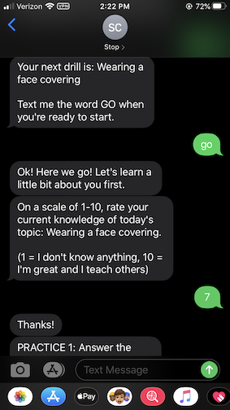
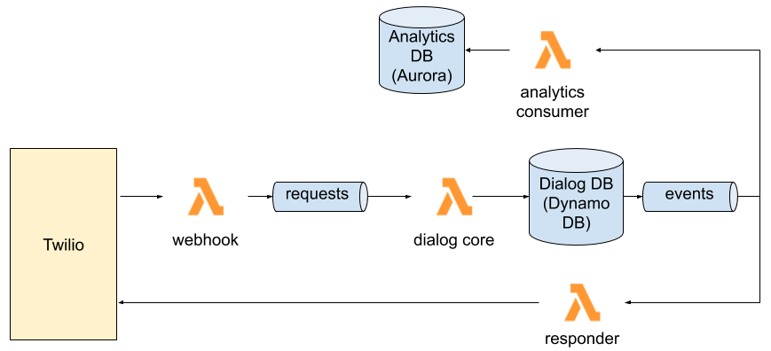

# The StopCOVID Dialog Engine

This repo contains the production code that powers [StopCOVID](https://www.stopcovid.co/). It's licensed as open-source software (see [license](LICENSE)) so feel free to copy as you see fit for your needs.

The code in this repo is deployed on Amazon's serverless platform, using Lambda, Kinesis, DynamoDB, among other things. This was our first substantial experience writing a serverless app, and we were pleasantly surprised by how quickly we could create a useful app with well-defined, decoupled components. If you're curious about building serverless event-driven applications, have a look around this repo and copy what you'd like.

We also welcome feedback and advice. We built this in a hurry and there's room for improvement. Demand for StopCOVID has been high and it was critical to get something launched as soon as we could. So you'll find rough edges.

## About StopCOVID

StopCOVID is a volunteer effort that provides COVID-19 training for essential businesses. We are partnering with essential businesses of all sizes to stop the spread of COVID-19 by providing free, high-impact training for frontline workers delivered over text message. See [our website](https://www.stopcovid.co/) for more information.

Each trainee receives one interactive daily drill over SMS. Each drill has about five questions, and stopCOVID reports statistics on drill completion back to employers.

*A StopCOVID drill, in progress.*

## Architecture

The StopCOVID backend is serverless and event-driven. The core of the system is a Lambda function that receives commands from a Kinesis stream and produces events to a DynamoDB table and stream. Consumers of the event stream respond to the user and track per-user drill progress.

*A simplified overview of the StopCOVID architecture.*

For a lot more detail, see the [architecture overview](docs/README.md).

## Interesting parts of the code

The heart of the system is in [`engine.py`](stopcovid/dialog/engine.py) and, in particular, the `process_command()` function. Here you'll see how we process commands and churn out a series of events in response.

We aggressively adopted type checking. We used Python type hints wherever we could and we used the [pyright](https://github.com/microsoft/pyright) type checker to enforce type hints. We also used [Marshmallow](https://marshmallow.readthedocs.io/en/stable/) schemas for everything that we serialized to or deserialized from JSON.

## The simulator

You can simulate the core of dialog processing on the command line — by feeding the dialog engine with command-line entries rather than entries from a kinesis stream. Try it out by running `python simulator.py`.

## `manage.py`

The `manage.py` script contains commands that we've found helpful while operating the Dialog Engine in production. You'll need appropriate AWS credentials in your environment to use this script. Type `python manage.py --help` for info on what this script can do.

## CI
We use [black](https://black.readthedocs.io/en/stable/) for code formatting and flake8 for linting, with a custom rule setting maximum line length to 100.
- `black --config black.toml .`
- `flake8`

## Running tests
- Run `docker-compose up` in the `db_local` directory
- `python -m unittest`