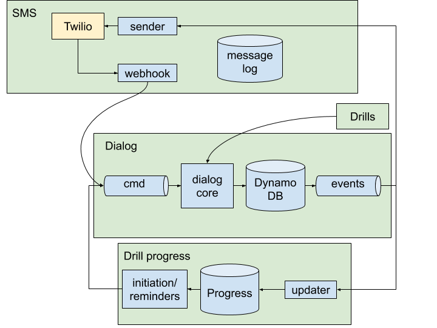

# Architecture

There are four parts of the system. They are [bounded contexts](https://martinfowler.com/bliki/BoundedContext.html) as defined by Domain-Driven Design and so they're referred to as Contexts throughout the documentation:

* **[Dialog](dialog.md)**: Manages a user’s progress through an individual drill. Doesn't know about a user's future or past drills.
* **[Drill progress](drill-progress.md)**: Tracks each user’s progress through all drills. Initiates new drills and sends reminders for incomplete drills.
* **[SMS](sms.md)**: Sends and receives SMS messages via Twilio.
* **[Drills](drills.md)**: Contains drill content, including list of questions to ask, correct answers, and translations into several languages.

*Data flow, illustrating 4 bounded contexts: Dialog, SMS, Drills, and Drill Progress. Some components omitted for clarity.*

These four bounded contexts are eventually consistent with each other. That is, there might be a delay for something that happens in the Dialog Context to propagate to the Drill Progress Context. But it will eventually propagate. The contexts communicate over narrowly defined interfaces:

* **Dialog Command Stream**, a Kinesis stream. The Dialog Context acts in response to commands and it receives those commands over a Kinesis stream called the Dialog Command Stream.
* **Dialog Event Stream**, a DynamoDB stream. The Dialog Context responds to commands by emitting events to the Dialog Event Stream. Those events are consumed by the SMS context, which translates them into outbound SMS messages. They are also consumed by the Drill Progress context, which initiates drills and updates information on who has completed which drills.
* **Drills API**. Retrieves a specific drill. Invoked synchronously from the dialog context.

## Scaling the system

The core scaling principle is that we can process work for multiple phone numbers in parallel. But each component handles work for an individual phone number serially and in order.
 
 We've configured our streams to allow parallel processing of multiple phone numbers and serial processing within each phone number. The phone number is the partition key for the Dialog Command Stream and the Dialog Event Stream. We ensure serial processing within the SMS context by using the phone number as the message group ID for the SMS sending FIFO queue.

**If there is a bottleneck in the dialog engine**, we can increase throughput by adding shards to the Dialog Command Stream. That increase the amount of processing that we can do in parallel.

**If there is a bottleneck in SMS sending**, we can increase the number of queue processors for the SMS sending queue. See [the SMS Context](sms.md) for more information.

**If there is a slowdown in initiating drills on-demand**, either when the user first validates or when they type "MORE" to request a new drill, something might be going wrong in the Drill Progress context. Try to get any expensive queries of the Drill Progress DB off the critical path for those events. See the [updater](../stopcovid/drill_progress/aws_lambdas/update_drill_status.py) and the documentation on the [Drill Progress Context](drill-progress.md).

**Don't let any component do parallel processing for a phone number.** Each component makes assumption that no other instance of that component is working on that phone number at the same time. It is okay for different components (e.g., the Drill Status Context updater and the Dialog Context command handler) to be simultaneously be working on the same phone number.
