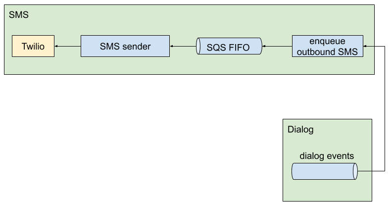
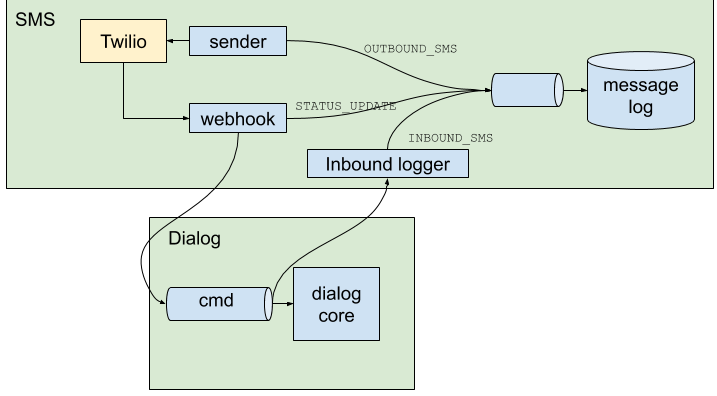

# SMS Context

The SMS Context is exchanging messages with users via Twilio. It handles both sending and receiving of messages.

## Inbound SMS

Inbound messages are messages from users to the StopCOVID system. All inbound messages arrive in the system via the Twilio webhook. For each message, we enqueue a command in the Dialog Context's command queue to process the message.

## Outbound SMS

Outbound messages are messages from the StopCOVID system to users. Currently all outbound messages are triggered by events from the Dialog Context.

Our dialog event processor reads from the Dialog Event Stream and enqueues message sending commands to an SQS FIFO queue. Our "SMS sender" sends messages from that queue to Twilio.

We introduced the SQS queue to give us the ability to parallelize message sending if we needed to. DynamoDB streams are effectively capped at two listening lambdas per shard. We ensure that messages are processed in order per phone number using the SQS [message group](https://docs.aws.amazon.com/AWSSimpleQueueService/latest/SQSDeveloperGuide/using-messagegroupid-property.html) feature.

## Message logging

We maintain a log of SMS delivery events, both inbound and outbound, in a Kinesis Message Log Stream. We then write the contents of the Message Log Stream to a SQL database for easy querying.

There are three types of messages, which we obtain in three different ways:

* `OUTBOUND_SMS`: Logged by our [SMS sender](../stopcovid/sms/aws_lambdas/send_sms_batch.py) after sending messages to Twilio.
* `INBOUND_SMS`: Logged by our [Inbound SMS logger](../stopcovid/sms/aws_lambdas/log_inbound_sms.py), which listens to the Dialog Command Stream.
* `STATUS_UPDATE`: Logged by the [twilio webhook](../stopcovid/sms/aws_lambdas/twilio_webhook.py).

## Components

* [Twilio webhook](../stopcovid/sms/aws_lambdas/twilio_webhook.py): A lambda reachable via Amazon's API Gateway.
* [Event stream processor](../stopcovid/sms/aws_lambdas/enqueue_sms_batch.py) that listens to the Dialog Event Stream and enqueues SMS messages into an SQS FIFO queue for sending.
* [SMS sender](../stopcovid/sms/aws_lambdas/send_sms_batch.py) that sends SMS commands to twilio.
* [Inbound SMS logger](../stopcovid/sms/aws_lambdas/log_inbound_sms.py) that listens to the Dialog Command Stream and logs inbound SMS messages to the Message Log Stream.
* [Log persister](../stopcovid/sms/aws_lambdas/persist_logs.py) that listens to the Message Log Stream and records message log entries in a SQL database.
* Message log database (Amazon Aurora)
